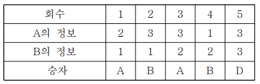
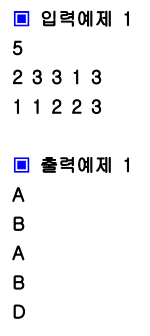

## ❓ 문제 03

A, B 두 사람이 가위바위보 게임을 한다.
총 N번의 게임을 하여 A가 이기면 A를 출력하고,
B가 이기면 B를 출력한다.
비길 경우에는 D를 출력한다.

가위, 바위, 보의 정보 1:가위, 2:바위, 3:보

두 사람의 각 회의 가위, 바위, 보 정보가 주어지면 각 회를 누가 이겼는지 출력하기

---

[**입력**]

첫 번째 줄: 게임 횟수인 자연수 N(1<=N<=100)

두 번째 줄: A가 낸 가위, 바위, 보 정보 N개

세 번째 줄: B가 낸 가위, 바위, 보 정보 N개

[**출력**]

각 줄 각 회의 승자를 출력

