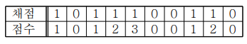

## ❓ 문제 04

OX 문제는 맞거나 틀린 두 경우의 답을 가지는 문제이다.

여러 개의 OX 문제로 만들어진 시험에서 연속적으로 답을 맞히는 경우에는 가산점을 주기 위해서 다음과 같이 점수 계산한다.

1번 문제가 맞는 경우에는 1점.

앞의 문제에 대해서는 답을 틀리다가 답이 맞는 처음 문제는 1점으로 계산.

연속으로 문제의 답이 맞는 경우에서 두 번째
문제는 2점, 세 번째 문제는 3점, ..., K번째 문제는 K점으로 계산.

틀린 문제는 0점으로 계산.

예를 들어, 아래와 같이 10 개의 OX 문제에서 답이 맞은 문제의 경우에는 1로 표시하고, 틀린 경우에는 0으로 표시하였을 때, 점수 계산은 1+1+2+3+1+2 = 10점이다.

시험문제의 채점 결과가 주어졌을 때, 총 점수를 계산하기

---

[**입력**]

첫 번째 줄: 문제의 개수 N

두 번째 줄: N개 문제의 채점 결과를 나타내는 0 혹은 1이 빈 칸을 사이에 두고 주어진다

[**출력**]

점수 출력
